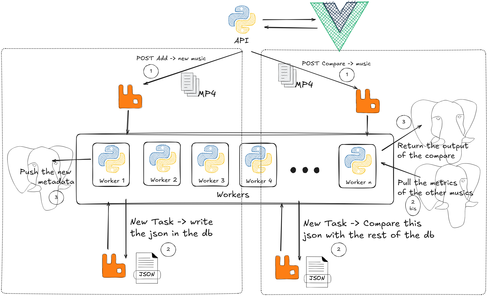

# openshaz

## Setup

- copier le .env.example en .env et remplir les variables d'environnement
- Up la stack
- Vas dans rustfs et crée les buckets `opensource-songs` et `query-songs` (avec les credentials du .env)
- tester l'api

## T0D0 list

- [ ] Dans le post api : extraire le mp3
- [x] Postgres: stocke les features extraites (deux tables dont open source et test)
- [ ] worker: similarité, renvoyer les résultats au api
- [ ] Postgres: stocke les métadonnées des fichiers (nom, durée, artistes, album, etc)
- [ ] Frontend: interface utilisateur pour uploader un mp3 et voir les résultats
